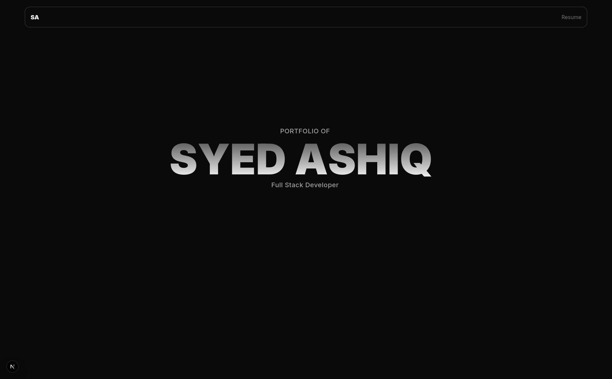
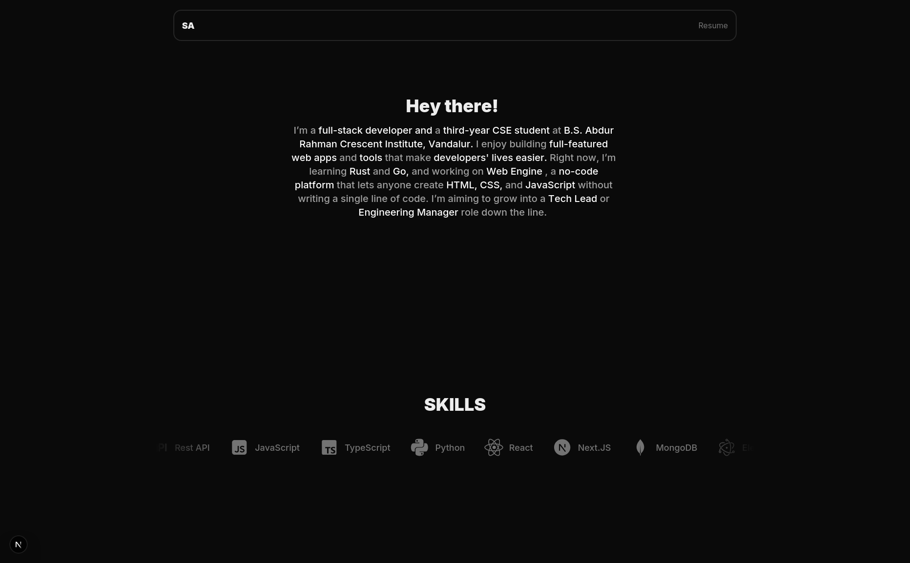
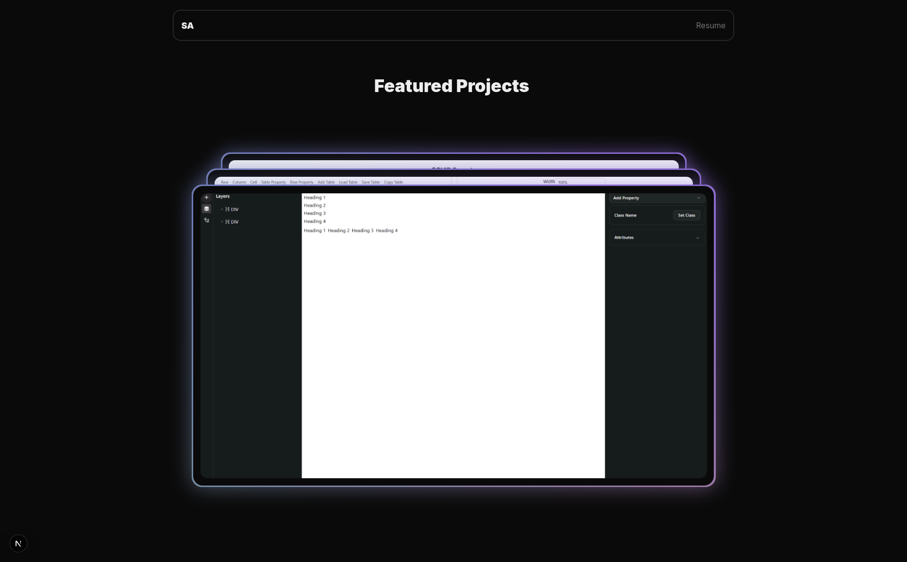

# 🚀 My Portfolio Website

Welcome to the source code of my personal portfolio website!  
This project showcases my skills, projects, and experience as a full-stack developer.

---

## 🛠️ Tech Stack

-   **Frontend:** Next.js, React, Tailwind CSS
-   **Backend (if applicable):** Node.js, Express.js
-   **Database (if applicable):** MongoDB / PostgreSQL
-   **Hosting:** Vercel / Netlify
-   **Version Control:** Git & GitHub

---

## 🎯 Features

-   📄 Responsive and mobile-friendly design
-   🖼️ Projects section with live demos & GitHub links
-   🧑‍💻 About Me and Contact Links
-   🌐 SEO optimization (meta tags, Open Graph)
-   🌙 Light/Dark mode toggle
-   ⚡ Fast loading and optimized performance

---

## 📸 Preview

---

## 🌐 Live Demo

🔗 [Visit My Live Portfolio](https://syedashiq.vercel.app/)

---
